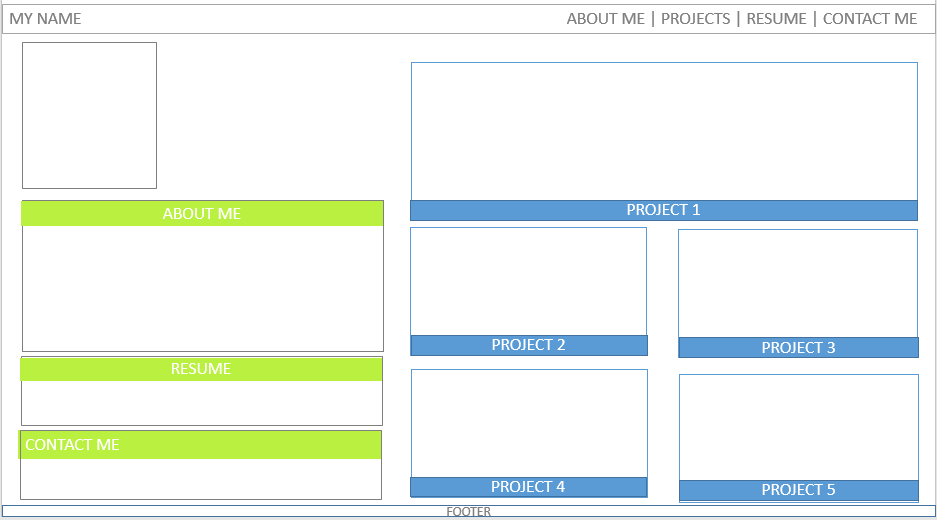
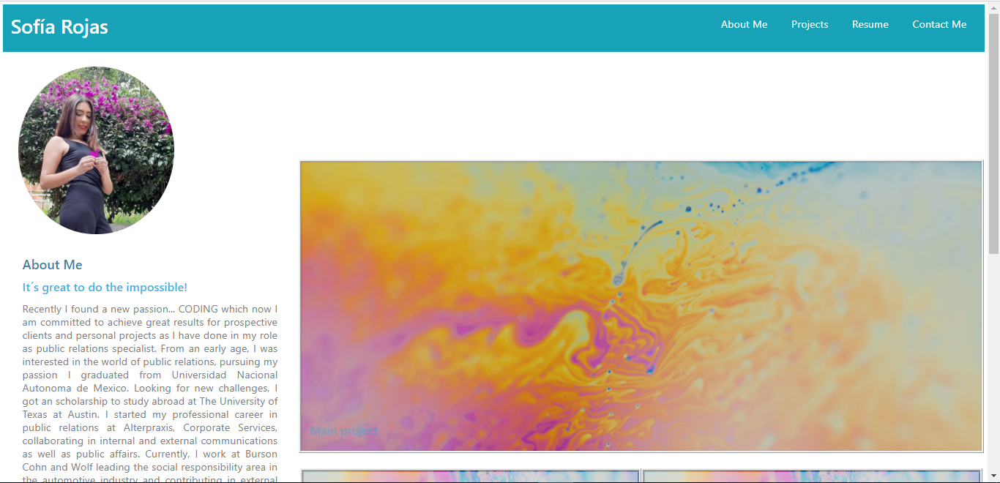
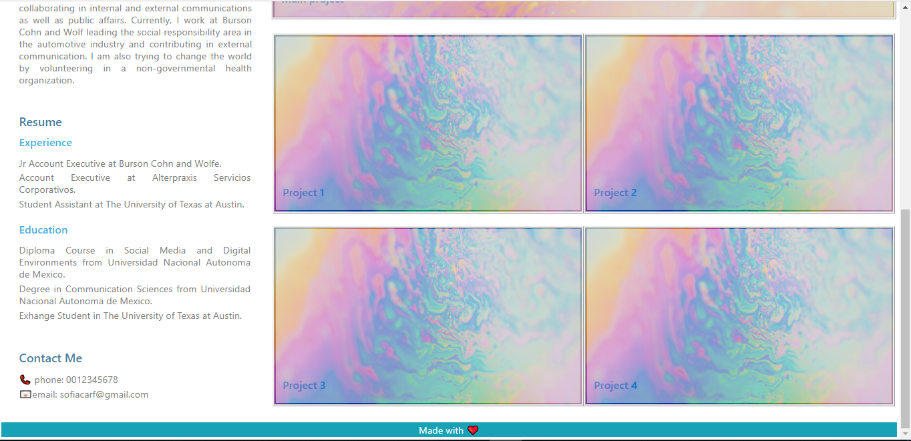

# my-portfolio

## Description
The project was made in order to build my portfolio, which contains a sample of my main projects, resume and contact information. The portfolio highlights recruiters and other programmers some of the skills I have developed and are shown in the website. 

## Project status
The portfolio will be updated with the links and preview of the projects that I´m working on. 

## Installation
 * Create a wireframming
 * Create a repo on GitHub
 * Clone the repo on the computer
 * Create an HTML file and a CSS file
 * Write the HTML code based in the wireframming
 * Write the CSS
 * Pull and commit chamges on GitHub
 * Publish the website on GitHub pages

## Wireframing Preview

## Finished Project

## Link to the website
